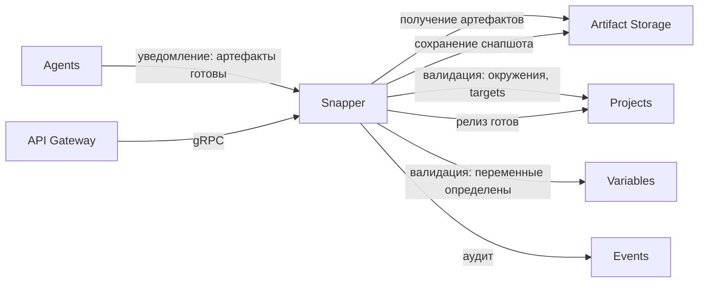
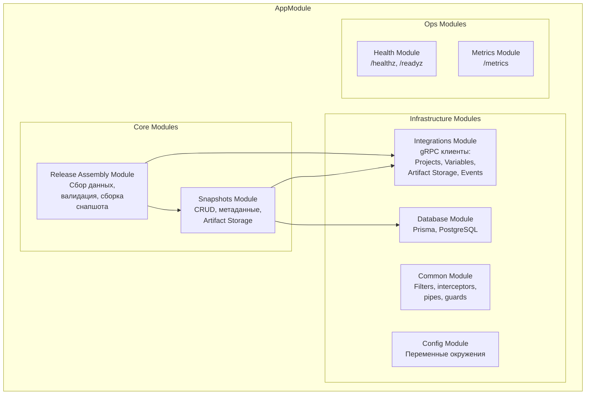
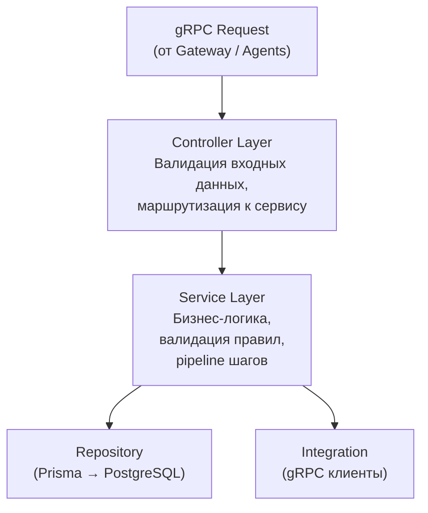
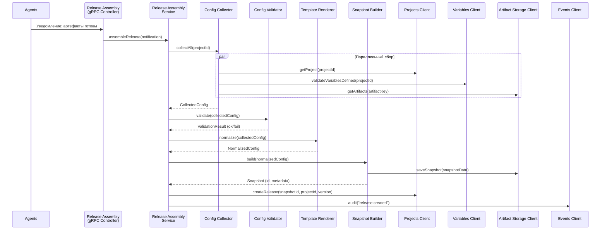

# Архитектура Snapper Microservice

## Принципы архитектуры

1. **Модульность** — каждый домен (snapshots, release-assembly, integrations, health) изолирован в своём модуле
2. **Слоистость** — четкое разделение: controllers → services → repositories → entities
3. **Snapper = валидатор + сборщик** — валидирует конфигурацию и собирает иммутабельный снапшот; оркестрация деплоя — ответственность Processes
4. **gRPC-first** — единственный внешний интерфейс (REST-эндпоинты только для health/metrics); frontend взаимодействует через API Gateway
5. **SOLID + DDD** — Domain-Driven Design для бизнес-логики, принципы SOLID для расширяемости
6. **Узкая зона ответственности** — Snapper не работает с git, не разрешает секреты, не управляет деплоем, не хранит S3-креды
7. **Storage через gRPC** — Snapper обращается к Artifact Storage как к внешнему сервису по gRPC (pluggable backend — забота Artifact Storage)

## Что сделать до реализации Snapper (NestJS)

1. Зафиксировать gRPC-контракты: какие методы экспонирует Snapper, какие методы нужны от `Projects`, `Variables` и `Artifact Storage`.
2. Определить модель снапшота: какие поля включает snapshot, где заканчивается ответственность Snapper и начинается ответственность Processes.
3. Прописать интерфейс взаимодействия с `Artifact Storage`: формат ключей/контента, idempotency-ключи, SLA/таймауты, retention-политика.
4. Спроектировать БД для снапшотов (таблицы + статусы) так, чтобы повторная доставка уведомлений от Agents была безопасной (idempotency).
5. Определить gRPC-метод приёма уведомлений от Agents (входящий контракт).

## Место Snapper в платформе



## Обзор модулей



## Описание модулей

### 1. Snapshots Module — ядро снапшотов

**Ответственность:** CRUD операции с метаданными снапшотов в PostgreSQL, координация сохранения/получения данных через Artifact Storage.

**Компоненты:**
- `SnapshotsGrpcController` (gRPC) — API для микросервисов (Gateway, Agents)
- `SnapshotsService` — бизнес-логика CRUD
- `SnapshotBuilderService` — формирование иммутабельного снапшота из валидированных данных
- `SnapshotsRepository` — работа с БД (Prisma)

**Зависимости:** IntegrationsModule (ArtifactStorageClient), DatabaseModule

### 2. Release Assembly Module — сборка и валидация релиза

**Ответственность:** Приём уведомлений от Agents, параллельный сбор данных из сервисов платформы, валидация конфигурации, создание иммутабельного снапшота. Секреты не разрешаются — Snapper только проверяет, что необходимые переменные **определены**.

**Компоненты:**
- `ReleaseAssemblyGrpcController` (gRPC) — входная точка для уведомлений от Agents и запросов через Gateway
- `ReleaseAssemblyService` — главный сервис сборки (pipeline шагов)
- `ConfigCollectorService` — параллельный сбор данных из Projects, Variables
- `ConfigValidatorService` — валидация собранной конфигурации
- `TemplateRendererService` — нормализация шаблонов (плейсхолдеры переменных остаются как есть, без подстановки значений)
- `ReleaseAssembliesRepository` — отслеживание статуса сборки

**Зависимости:** SnapshotsModule, IntegrationsModule

### 3. Integrations Module — gRPC клиенты

**Ответственность:** Обёртки над gRPC клиентами для всех внешних сервисов, с которыми взаимодействует Snapper.

**Компоненты:**
- `ProjectsClient` — валидация окружений/targets, регистрация релиза
- `VariablesClient` — валидация определения переменных (без расшифровки секретов)
- `ArtifactStorageClient` — получение/сохранение артефактов и снапшотов
- `EventsClient` — отправка аудит-событий

**Паттерны:**
- Retry с exponential backoff
- Circuit breaker
- Timeout настройки
- Структурированное логирование вызовов

### 4. Common Module — общие компоненты

**Компоненты:**
- Фильтры: `GrpcExceptionFilter`, `AllExceptionsFilter`
- Интерцепторы: `LoggingInterceptor`, `TimeoutInterceptor`
- Pipes: `ValidationPipe`, `ParseUuidPipe`
- Интерфейсы: `PaginationInterface`, `ResponseInterface`
- Утилиты: `uuid`, `json`, `crypto` (хеширование снапшотов)
- Константы: error codes, statuses

### 5. Health Module — проверка здоровья

**Эндпоинты (REST, для Kubernetes probes):**
- `GET /healthz` — liveness (приложение запущено)
- `GET /readyz` — readiness (БД подключена, gRPC клиенты инициализированы)

### 6. Metrics Module — метрики

**Эндпоинт (REST, для Prometheus scrape):** `GET /metrics`

## Слои архитектуры



## Поток данных: Создание релиза



## Паттерны и практики

### Pipeline Pattern (Release Assembly)

Сборка релиза реализуется как pipeline шагов. Каждый шаг — отдельный сервис с единой ответственностью.

```typescript
async assembleRelease(notification: ArtifactNotification): Promise<AssemblyResult> {
  const assembly = await this.createAssembly(notification);

  try {
    // Шаг 1: Сбор данных (параллельно)
    await this.updateStep(assembly, 'collect_data', 'in_progress');
    const collectedData = await this.configCollector.collectAll(notification.projectId);
    await this.updateStep(assembly, 'collect_data', 'completed');

    // Шаг 2: Валидация
    await this.updateStep(assembly, 'validate_config', 'in_progress');
    await this.configValidator.validate(collectedData);
    await this.updateStep(assembly, 'validate_config', 'completed');

    // Шаг 3: Нормализация шаблонов (плейсхолдеры остаются, секреты не подставляются)
    await this.updateStep(assembly, 'normalize_templates', 'in_progress');
    const normalized = await this.templateRenderer.normalize(collectedData);
    await this.updateStep(assembly, 'normalize_templates', 'completed');

    // Шаг 4: Создание иммутабельного снапшота
    await this.updateStep(assembly, 'create_snapshot', 'in_progress');
    const snapshot = await this.snapshotBuilder.build(normalized, notification);
    await this.updateStep(assembly, 'create_snapshot', 'completed');

    // Шаг 5: Регистрация релиза в Projects
    await this.updateStep(assembly, 'register_release', 'in_progress');
    await this.projectsClient.createRelease(snapshot.id, notification);
    await this.updateStep(assembly, 'register_release', 'completed');

    // Шаг 6: Аудит
    await this.updateStep(assembly, 'send_audit', 'in_progress');
    await this.eventsClient.sendReleaseCreated(snapshot, notification);
    await this.updateStep(assembly, 'send_audit', 'completed');

    return this.completeAssembly(assembly, 'completed');
  } catch (error) {
    return this.failAssembly(assembly, error);
  }
}
```

### Dependency Injection
- Все зависимости через конструкторы
- NestJS DI контейнер
- Интерфейсы для абстракций (injection tokens)

### Repository Pattern
- Абстракция доступа к данным через Prisma
- Отдельный репозиторий для каждой сущности

### Service Layer Pattern
- Бизнес-логика только в сервисах
- Контроллеры тонкие — только маршрутизация
- Один сервис — одна ответственность

### DTO Pattern
- Отдельные DTO для создания, обновления, запросов, ответов
- Валидация через class-validator
- Трансформация через class-transformer

## Тестирование

### Unit тесты
- Тесты для каждого сервиса pipeline (ConfigCollector, ConfigValidator, TemplateRenderer, SnapshotBuilder)
- Тесты для ReleaseAssemblyService (полный pipeline)
- Моки для gRPC клиентов

### Integration тесты
- Тесты gRPC методов
- Тесты с реальным PostgreSQL (testcontainers)
- Тесты взаимодействия с Artifact Storage (testcontainers)

### E2E тесты
- Полный flow создания релиза (от уведомления Agents до регистрации в Projects)
- Валидация конфигурации (dry run)
- Идемпотентность повторных уведомлений

## Безопасность

### Аутентификация и авторизация
- Аутентификация выполняется на **API Gateway** через Zitadel (OIDC)
- Между сервисами — **mTLS** (настраивается через service mesh / Kuma)
- Snapper **не валидирует JWT-токены** напрямую; Gateway передаёт идентификатор пользователя через gRPC metadata

### Защита данных
- Snapper **не имеет доступа к секретам** — только валидирует, что переменные определены
- Артефакты и снапшоты хранятся в Artifact Storage (отдельный сервис)
- Аудит ключевых операций через Events

### Принцип наименьших привилегий
- Snapper не обращается к Variables за значениями секретов
- Snapper не взаимодействует с Processes, Worker, Targets Controller
- Минимальный набор gRPC-клиентов: Projects, Variables, Artifact Storage, Events

## Мониторинг и логирование

### Структурированное логирование
```json
{
  "level": "info",
  "timestamp": "2026-03-20T10:00:00Z",
  "service": "snapper",
  "correlationId": "uuid",
  "message": "Snapshot created",
  "context": {
    "snapshotId": "uuid",
    "projectId": "uuid",
    "version": "1.0.0",
    "durationMs": 3420
  }
}
```

### Уровни логирования
- `error` — ошибки, требующие внимания
- `warn` — предупреждения (недоступность сервиса, retry)
- `info` — ключевые операции (создание снапшота, сборка релиза)
- `debug` — детальная информация для отладки

### Health Checks
- **Liveness** (`/healthz`): приложение запущено
- **Readiness** (`/readyz`): БД подключена, gRPC клиенты инициализированы

## Масштабирование

### Горизонтальное
- Stateless архитектура — каждый инстанс независим
- БД и Artifact Storage как внешние зависимости
- Connection pooling (Prisma)

### Вертикальное
- Оптимизация запросов к БД (индексы)
- Параллельный сбор данных (Promise.all)
- Кэширование конфигурации проектов (TTL-based)

### Добавление новых фич
1. Создать новый модуль в `src/`
2. Определить Prisma-модели, repositories, services, gRPC controllers
3. Зарегистрировать модуль в `app.module.ts`
4. Добавить миграции (Prisma)
5. Обновить proto файлы (если gRPC)
6. Добавить интеграционный клиент (если новый сервис)
