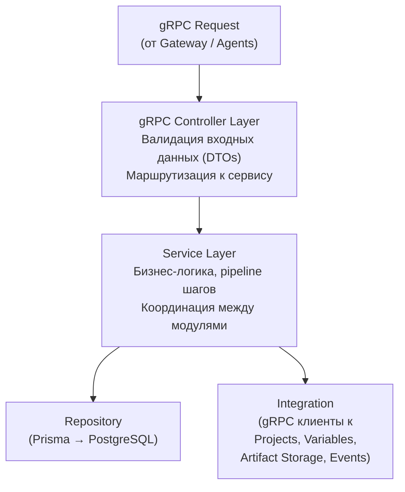
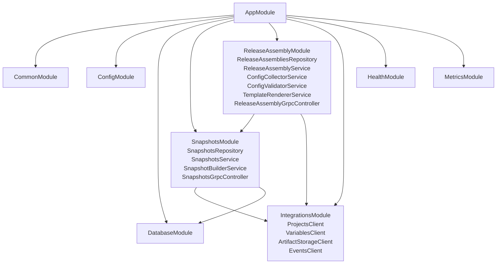

# Структура проекта — Snapper Microservice

## Полное дерево директорий

```
snapper-microservice/
│
├── docs/                               # Документация
│   ├── ARCHITECTURE.md                 # Архитектура
│   ├── PROJECT_STRUCTURE.md            # Этот файл
│   ├── STRUCTURE_GUIDE.md              # Примеры кода
│   ├── SCALING_GUIDE.md                # Масштабирование
│   └── QUICK_REFERENCE.md             # Быстрая справка
│
├── package.json
├── bun.lock
├── tsconfig.json
├── tsconfig.build.json
├── nest-cli.json
├── eslint.config.mjs
├── .prettierrc
├── .gitignore
├── .env.example                        # Пример переменных окружения
├── Dockerfile
├── docker-compose.yml                  # Dev-окружение (PostgreSQL)
├── README.md
│
├── src/
│   │
│   ├── main.ts                         # Точка входа (gRPC сервер + REST для health/metrics)
│   ├── app.module.ts                   # Корневой модуль
│   ├── app.service.ts                  # health эндпоинты
│   │
│   ├── common/                         # Общие компоненты
│   │   ├── common.module.ts
│   │   │
│   │   ├── filters/
│   │   │   ├── index.ts
│   │   │   ├── grpc-exception.filter.ts    # Обработка gRPC ошибок
│   │   │   └── all-exceptions.filter.ts    # Глобальный обработчик
│   │   │
│   │   ├── interceptors/
│   │   │   ├── index.ts
│   │   │   ├── logging.interceptor.ts      # Логирование запросов
│   │   │   └── timeout.interceptor.ts      # Таймауты
│   │   │
│   │   ├── pipes/
│   │   │   ├── index.ts
│   │   │   ├── validation.pipe.ts          # Кастомная валидация
│   │   │   └── parse-uuid.pipe.ts          # Парсинг UUID
│   │   │
│   │   ├── interfaces/
│   │   │   ├── index.ts
│   │   │   ├── pagination.interface.ts     # Интерфейс пагинации
│   │   │   └── response.interface.ts       # Стандартный формат ответа
│   │   │
│   │   ├── utils/
│   │   │   ├── index.ts
│   │   │   ├── uuid.util.ts               # Генерация UUID
│   │   │   ├── json.util.ts               # Работа с JSON
│   │   │   ├── crypto.util.ts             # Хеширование (checksum снапшотов)
│   │   │   └── retry.util.ts              # Retry с exponential backoff
│   │   │
│   │   └── constants/
│   │       ├── index.ts
│   │       ├── error-codes.const.ts        # Коды ошибок
│   │       ├── snapshot-status.const.ts    # Статусы снапшотов
│   │       └── assembly-status.const.ts    # Статусы сборки релиза
│   │
│   ├── config/                             # Конфигурация приложения
│   │   ├── config.module.ts
│   │   ├── config.service.ts
│   │   ├── config.interface.ts
│   │   └── configs/
│   │       ├── index.ts
│   │       ├── app.config.ts               # GRPC_PORT, NODE_ENV
│   │       ├── database.config.ts          # PostgreSQL
│   │       └── grpc.config.ts              # gRPC URL-ы сервисов
│   │
│   ├── database/                           # Настройка БД
│   │   ├── database.module.ts
│   │   ├── database.service.ts             # Prisma client wrapper
│   │   ├── schema.prisma                   # Prisma schema
│   │   └── migrations/                     # Prisma migrations
│   │
│   ├── snapshots/                          # Модуль снапшотов (метаданные + Artifact Storage)
│   │   ├── snapshots.module.ts
│   │   │
│   │   ├── grpc/
│   │   │   ├── index.ts
│   │   │   └── snapshots.grpc.controller.ts    # gRPC API
│   │   │
│   │   ├── services/
│   │   │   ├── index.ts
│   │   │   ├── snapshots.service.ts            # CRUD бизнес-логика
│   │   │   └── snapshot-builder.service.ts     # Формирование снапшота
│   │   │
│   │   ├── repositories/
│   │   │   ├── index.ts
│   │   │   └── snapshots.repository.ts
│   │   │
│   │   ├── dto/
│   │   │   ├── index.ts
│   │   │   ├── create-snapshot.dto.ts
│   │   │   ├── snapshot-query.dto.ts
│   │   │   └── snapshot-response.dto.ts
│   │   │
│   │   ├── interfaces/
│   │   │   ├── index.ts
│   │   │   ├── snapshot.interface.ts
│   │   │   └── snapshot-config.interface.ts
│   │   │
│   │   └── __tests__/
│   │       ├── snapshots.service.spec.ts
│   │       ├── snapshot-builder.service.spec.ts
│   │       └── snapshots.repository.spec.ts
│   │
│   ├── release-assembly/                   # Сборка и валидация релиза
│   │   ├── release-assembly.module.ts
│   │   │
│   │   ├── grpc/
│   │   │   ├── index.ts
│   │   │   └── release-assembly.grpc.controller.ts  # gRPC API
│   │   │
│   │   ├── services/
│   │   │   ├── index.ts
│   │   │   ├── release-assembly.service.ts     # Главный сервис сборки (pipeline)
│   │   │   ├── config-collector.service.ts     # Параллельный сбор данных
│   │   │   ├── config-validator.service.ts     # Валидация конфигурации
│   │   │   └── template-renderer.service.ts    # Нормализация шаблонов
│   │   │
│   │   ├── repositories/
│   │   │   ├── index.ts
│   │   │   └── release-assemblies.repository.ts
│   │   │
│   │   ├── dto/
│   │   │   ├── index.ts
│   │   │   ├── artifact-notification.dto.ts
│   │   │   ├── assembly-status.dto.ts
│   │   │   └── validate-config.dto.ts
│   │   │
│   │   ├── interfaces/
│   │   │   ├── index.ts
│   │   │   ├── release-assembly.interface.ts
│   │   │   ├── collected-config.interface.ts
│   │   │   └── assembly-step.interface.ts
│   │   │
│   │   └── __tests__/
│   │       ├── release-assembly.service.spec.ts
│   │       ├── config-collector.service.spec.ts
│   │       ├── config-validator.service.spec.ts
│   │       └── template-renderer.service.spec.ts
│   │
│   ├── integrations/                       # gRPC клиенты внешних сервисов
│   │   ├── integrations.module.ts
│   │   │
│   │   ├── artifact-storage/
│   │   │   ├── index.ts
│   │   │   ├── artifact-storage.client.ts
│   │   │   ├── artifact-storage.interface.ts
│   │   │   └── artifact-storage.client.spec.ts
│   │   │
│   │   ├── projects/
│   │   │   ├── index.ts
│   │   │   ├── projects.client.ts
│   │   │   ├── projects.interface.ts
│   │   │   └── projects.client.spec.ts
│   │   │
│   │   ├── variables/
│   │   │   ├── index.ts
│   │   │   ├── variables.client.ts
│   │   │   ├── variables.interface.ts
│   │   │   └── variables.client.spec.ts
│   │   │
│   │   └── events/
│   │       ├── index.ts
│   │       ├── events.client.ts
│   │       ├── events.interface.ts
│   │       └── events.client.spec.ts
│   │
│   ├── metrics/                            # Prometheus метрики
│   │   ├── metrics.module.ts
│   │   ├── metrics.service.ts
│   │   └── metrics.controller.ts           # /metrics (REST)
│   │
│   └── proto/                              # Protocol Buffers
│       ├── snapper.proto                   # Снапшоты + сборка релиза
│       └── generated/                      # Сгенерированные типы
│           └── .gitkeep
│
└── test/                                   # E2E тесты
    ├── e2e/
    │   ├── snapshots.e2e-spec.ts
    │   ├── release-assembly.e2e-spec.ts
    │   └── idempotency.e2e-spec.ts
    ├── fixtures/
    │   ├── snapshots.fixture.ts
    │   └── collected-config.fixture.ts
    └── jest-e2e.json
```

## Поток данных (Data Flow)



## Зависимости между модулями



## Быстрая навигация

- **Новый модуль?** → См. `STRUCTURE_GUIDE.md` → "Быстрый старт структуры"
- **Новый эндпоинт?** → См. `SCALING_GUIDE.md` → "Добавление нового эндпоинта"
- **Новая интеграция?** → См. `SCALING_GUIDE.md` → "Добавление интеграции с новым сервисом"
- **Шаблоны кода?** → См. `QUICK_REFERENCE.md` → "Шаблоны кода"
- **Архитектура?** → См. `ARCHITECTURE.md`
